# Cloudie

## 1. 개요

> 아이디어 배경

코로나 사태 이후  저조한 영화관 이용률 문제를 해결하기 위해 비슷한 취향을 가진 사용자들을 연결해 함께 영화를 보러 갈 수 있도록 하고자 하였다.

​	사용자는 재밌게 본 영화에 좋아요(like)를 누르고, Cloudie는 저장된 영화들의 장르 분석을 기반으로 사용자가 가장 좋아할 만한 장르의 영화를 추천함. 또한 사용자의 장르 선호도 분석 결과를 기반으로 비슷한 취향을 가진 사용자와 상호 연결에 활용하고자 하였다.

 함께 관람한 영화는 Cloudie의 게시판(community)에서 다른 사람들과 후기를 공유하고 의견을 주고받을 수 있다.

### 1-1. 파일 구성

```
final-pjt
 ┣ accounts
 ┃ ┣ migrations
 ┃ ┃ ┣ 0001_initial.py
 ┃ ┃ ┗ __init__.py
 ┃ ┣ static
 ┃ ┃ ┗ accounts
 ┃ ┃ ┃ ┗ sample.png
 ┃ ┣ templates
 ┃ ┃ ┗ accounts
 ┃ ┃ ┃ ┣ change_password.html
 ┃ ┃ ┃ ┣ login.html
 ┃ ┃ ┃ ┣ profile.html
 ┃ ┃ ┃ ┣ signup.html
 ┃ ┃ ┃ ┗ update.html
 ┃ ┣ admin.py
 ┃ ┣ apps.py
 ┃ ┣ forms.py
 ┃ ┣ models.py
 ┃ ┣ signals.py
 ┃ ┣ tests.py
 ┃ ┣ urls.py
 ┃ ┣ views.py
 ┃ ┗ __init__.py
 ┣ cloud
 ┃ ┣ asgi.py
 ┃ ┣ settings.py
 ┃ ┣ urls.py
 ┃ ┣ wsgi.py
 ┃ ┗ __init__.py
 ┣ community
 ┃ ┣ migrations
 ┃ ┃ ┣ 0001_initial.py
 ┃ ┃ ┗ __init__.py
 ┃ ┣ templates
 ┃ ┃ ┗ community
 ┃ ┃ ┃ ┣ create.html
 ┃ ┃ ┃ ┣ detail.html
 ┃ ┃ ┃ ┣ edit.html
 ┃ ┃ ┃ ┗ index.html
 ┃ ┣ admin.py
 ┃ ┣ apps.py
 ┃ ┣ forms.py
 ┃ ┣ models.py
 ┃ ┣ tests.py
 ┃ ┣ urls.py
 ┃ ┣ views.py
 ┃ ┗ __init__.py
 ┣ media
 ┃ ┣ static
 ┃ ┃ ┣ 손승환_사진_oWKU4AS.jpg
 ┃ ┃ ┗ 임상빈_사진.jpg
 ┃ ┣ cloudie_white.png
 ┃ ┗ default_profile.png
 ┣ movies
 ┃ ┣ migrations
 ┃ ┃ ┗ __init__.py
 ┃ ┣ templates
 ┃ ┃ ┗ movies
 ┃ ┃ ┃ ┣ detail.html
 ┃ ┃ ┃ ┣ index.html
 ┃ ┃ ┃ ┣ search.html
 ┃ ┃ ┃ ┗ select.html
 ┃ ┣ admin.py
 ┃ ┣ apps.py
 ┃ ┣ models.py
 ┃ ┣ serializers.py
 ┃ ┣ tests.py
 ┃ ┣ urls.py
 ┃ ┣ views.py
 ┃ ┗ __init__.py
 ┣ templates
 ┃ ┗ base.html
 ┣ _data_load
 ┃ ┣ genre_data.json
 ┃ ┣ loadgenre.py
 ┃ ┣ loadmovie.py
 ┃ ┣ movie_data.json
 ┃ ┗ movie_data_1000.json
 ┣ .gitignore
 ┣ cloud.pptx
 ┣ cloud_수정사항.md
 ┣ db.sqlite3
 ┣ finalPJT계획.md
 ┣ manage.py
 ┣ package-lock.json
 ┣ package.json
 ┣ README.md
 ┣ requirements.txt
 ┗ slide.css
```


### 1-2. DB 모델링

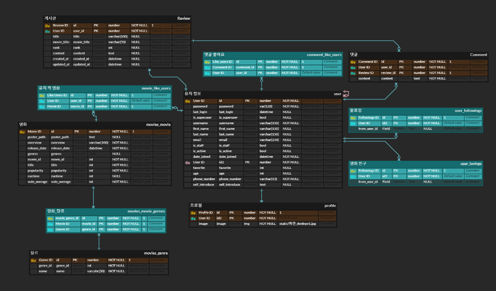


## 2. 프로젝트 목표

### 2-1. 서비스 목표

1. api를 활용한 영화정보 db를 구성하고 실시간 영화 데이터를 산출한다.
2. db 데이터와 실시간 api를 이용한 최신영화, 추천영화, 모든영화 목록을 display한다.
3. community의 영화 후기 작성, 댓글 작성을 활용한 사용자 간의 소통 창구를 제공한다.
4. 팔로잉, 팔로워 기능을 포함한 사용자 정보를 확인할 수 있는 프로필을 구현한다.
5. 영화 취향이 비슷한 사용자를 연결해주는 데이트 매칭 기능 구현한다.
6. 정보를 얻고자 하는 영화를 검색해 디테일 페이지로 연결할 수 있는 검색 기능을 구현한다.


### 2-2. 팀원 정보 및 업무 분담

1. 학습자의 입장에서 풀스택 경험으로 실력 향상을 도모하기 위해 기능별로 Driver와 Navigator를 번갈아 진행했다.
1. 자칫 모호해질 수 있는 업무 분담을 효과적으로 진행할 수 있도록 매 쉬는 시간 진행 정도와 진행 방향을 공유했다.
1. 피그마를 활용하여 현 진행 완료된 계획은 색상을 변경하여 점검했다.

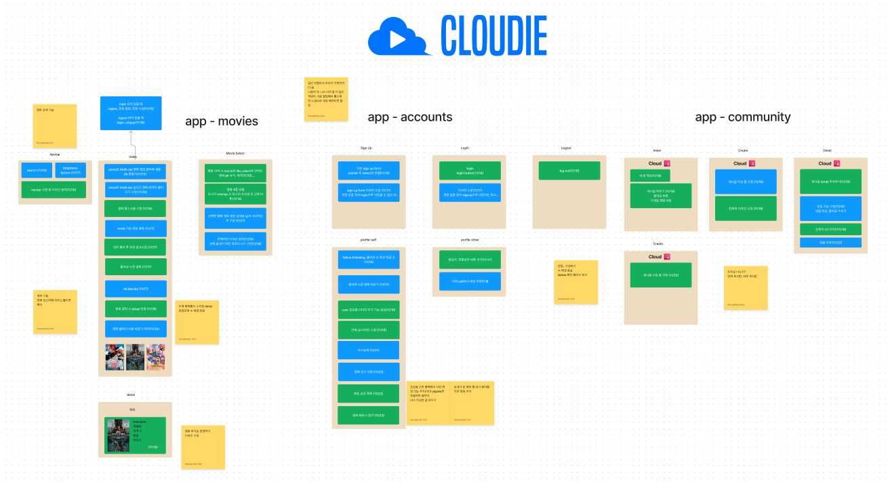

### 2-3. 대표 기능

1. movies

   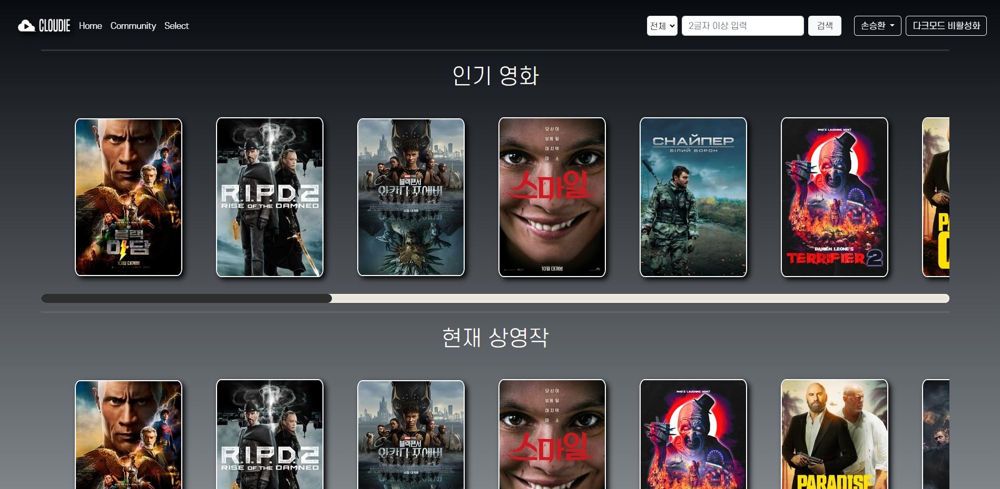

   1. TMDB api를 통해 영화데이터를 제공받아 DB에 저장하여 활용한다.
   2. user는 로그인 시 아래와 같은 내용을 추천 받는다.
      1. TMDB로부터 실시간으로 받아오는 최신 인기영화 목록
      2. user가 'like'한 영화들의 장르를 기반으로 선정된 user 전용 추천 영화 목록
      3. db에 존재하는 모든 영화 목록
   3. 추천목록의 각 영화 포스터를 클릭하면 영화별 세부 정보 페이지로 이동할 수 있다.

   

2. accounts

   1. user는 로그인을 해야만 사이트 이용이 가능하도록 되어있다.

   2. 회원 가입, 회원 탈퇴, 회원정보 수정, 비밀번호 변경, 로그인, 로그아웃 기능이 구현했다.

   3. 모든 user는 각자의 profile 페이지가 존재하며, 본인의 profile과 타인의 profile에 접속시 보여지는 화면이 다르다.

      1. 본인의 profile에 접속할 경우 상단의 정보 부분에는 팔로워, 팔로잉, 작성 게시글 수, 작성 댓글 수와 프로필 사진, like한 영화들의 포스터가 보여지고, 각 포스터를 클릭하면 해당 영화의 세부정보 페이지로 이동된다.

         본인의 profile에서는 사진 이미지를 변경할 수 있는 이미지 변경 버튼 이 있고 해당 버튼은 개인 정보 변경 페이지로 연결된다.

         본인의 profile에서는 매칭 시스템 또한 표시된다.

         매칭 시스템은 크게 3부분으로 나뉘어 진다.

         상대방으로부터 영화 친구 신청이 온 경우 프로필, 신청을 수락, 거절 할 수 있는 버튼을 포함한 신청 공간이 표시된다.

         매칭에 성공했을 경우 매칭된 사람의 자세한 정보와 상대의 프로필을 방문 할 수 있는 버튼이 있는 카드들이 표시된다.

         새로운 영화 친구를 찾기 위해 본인과 영화 취향이 비슷한 사용자가 추천되어 나열된 카드들이 표시된다.

      2. 상대방의 프로필에서는 매칭 부분이 표시되지 않고 전반적인 정보는 유사하나 이미지 변경 태그가 팔로우, 언팔로우 버튼으로 변경된다.

   

3. community

   1. 모든 user는 review 게시글을 작성할 수 있다.
   2. 게시글은 게시글 제목, review할 영화 제목, 본인이 주는 평점, review 내용으로 이루어진다.
   3. user는 본인이 작성한 review를 포함한 모든 게시글에 좋아요를 누를 수 있고, 다시 누르면 취소된다.
   4. 게시글들은 작성, 삭제, 수정, 조회가 모두 가능하다.
   5. community 메인 페이지에서는 최근에 작성된 게시글이 맨 위로 계속 쌓이는 방식으로 모든 게시글을 보여주며, 클릭할 경우 댓글을 달 수 있는 게시글 세부 페이지로 이동한다.
   6. 모든 user는 게시글의 세부 페이지에서 댓글을 달 수 있고, 게시글과 마찬가지로 좋아요와 좋아요 취소가 가능하다.


## 3. 실제 구현 정도

> 사용 아키텍처 : Django & Vanilla JavaScript

#### 네비게이션 바

- 네비게이션 바 좌측에 CLOUDIE 로고와 Home, Community, Select 버튼을 배치했다.
  - CLOUDIE로고와 Home 버튼 클릭 시 메인 화면인 movies:index로 이동한다.
  - Community 버튼 클릭 시 게시글을 작성하고 댓글로 유저들끼리 소통이 가능한 community:index로 이동한다.
  - Select 버튼 클릭 시 회원가입 직후 진행한 ''마음에 드는 영화 고르기'' 페이지로 이동하고, ''좋아요''한 영화를 좋아요 취소 하거나 새롭게 좋아요 표시 할 수 있다.
  
  
  
- 네비게이션 바 우측에 검색창과 계정 드롭 박스, 다크모드 버튼을 배치했다.
  - 검색창은 전체, 제목, 장르 검색 항목을 선택할 수 있다.
    - 전체 선택시 movies.title 혹은 genre.name에 검색어가 포함된 영화들의 목록을 출력한다.
    - 제목 선택시 movies.title에 검색어가 포함된 영화들의 목록을 출력한다.
    - 장르 선택시 genre.name에 검색어가 포함된 영화들의 목록을 출력한다.
  - 계정 드롭박스에는 로그인한 상태에는 username이 표기되고 버튼 클릭 시 프로필, 회원수정, 회원탈퇴, 로그아웃 버튼이 나타난다.
    - 프로필 클릭시 로그인한 유저의 accounts:profile로 이동한다.
    - 회원 수정 클릭시 로그인한 유저의 회원 정보를 수정할 수 있는 accounts:update페이지로 이동한다.
    - 회원 탈퇴를 클릭시 탈퇴 확인 alert창이 팝업된다.
      - 취소 클릭 시 창이 사라지고 탈퇴를 취소한다.
      - 확인 클릭 시 계정이 완전히 삭제되고 accounts:login 페이지로 이동한다.
    - 로그아웃 버튼 클릭시 계정이 로그아웃 된 후 accounts:login 페이지로 이동한다.
  - 로그아웃한 상태에는 ANONYMOUS가 표시되고 클릭 시 로그인, 회원가입이 나타난다.
    - 로그인 클릭시 accounts:login 페이지로 이동한다.
    - 회원가입 클릭시 accounts:signup 페이지로 이동한다.
  - 다크모드 버튼 클릭으로 다크모드를 활성화 비활성화 할 수 있다.
    - 다크모드 활성화 클릭 시 다크모드가 적용되고 '다크모드 비활성화'로 토글된다.
    - 다크모드 비활성화 클릭 시 다크모드가 해제되고 '다크모드 활성화'로 토글된다.


#### 계정

*  프로필

  * user 자신의 프로필에 접근한 경우

    * user 정보

      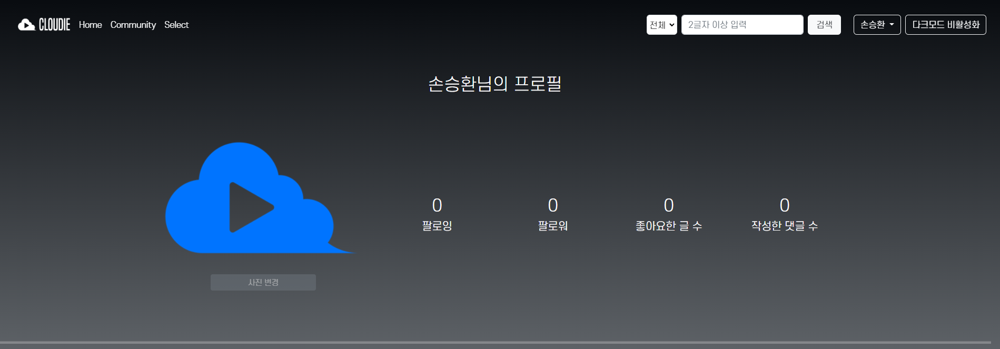

      

      * 회원가입시 프로필 사진을 등록하지 않은 경우 기본 이미지가 표시된다.

      하단의 사진 변경 버튼을 클릭하면 개인 정보 수정 페이지로 연결되어 프로필 사진을 새로 등록할 수 있다.

      * 팔로잉에는 user가 팔로우 한 사람의 수 가 표시된다.
      * 팔로워에는 user를 팔로우 한 사람의 수가  표시된다.
      * 좋아요한 글 수 에는 user가 좋아요 누른 게시글들의 수가 표시되어 얼마나 상대방의 글에 공감했는지 파악할 수 있다.
      * 작성한 댓글 수는 user가 작성한 댓글의 수가 표시되어 얼마나 적극적으로 의견을 공유했는지 파악할 수 있다.

      

      * 자기소개에는 회원가입 시 작성한 self_introduce가 이름, 성별, 최애 장르와 함께 표시된다.

    * user가 좋아하는 영화

      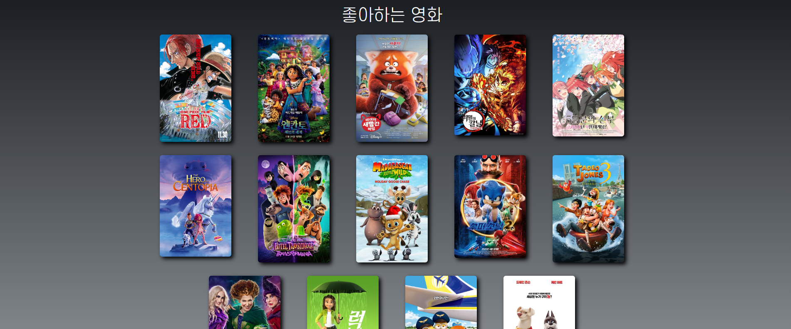

      * 회원가입시, 혹은 select 페이지에서 선택한 user가 좋아하는 영화 목록이 표시된다.
      * 영화 클릭시 해당 영화의 movies:detail 페이지로 이동한다.

    * 영화 친구 신청

      

      * 다른 user로 부터 영화신청이 오면 해당 부분에 영화 신청 알림이 표시된다.
      * 프로필 버튼 클릭시 요청이 온 user의 프로필 페이지로 이동한다.
      * 수락 버튼 클릭시 상호 영화 친구가 맺어졌으므로 하단의 매칭 성공 목록에 상대 user의 상세 정보가 표시된다.
      * 거절 버튼 클릭시 영화 친구가 거절되고 영화 친구 신청에서 거절한 배너가 사라진다.

    * 매칭 성공 목록

      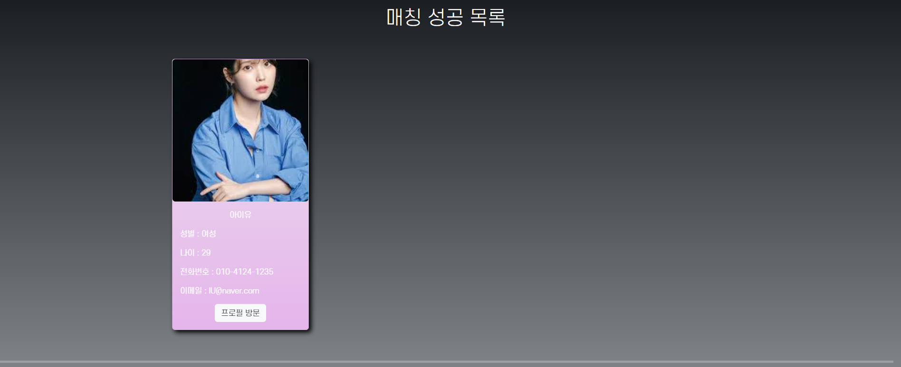

      * 상대의 영화 친구 신청을 수락하거나 내가 보낸 신청이 수락된 경우 매칭 성공 목록에 매칭된 user의 자세한 정보가 표시된다.
      * 프로필 방문 버튼으로 매칭된 user의 프로필로 이동할 수 있다.

    * 영화 친구 찾기

      

      * select에서 선택한 영화들을 기반으로 user가 좋아하는 장르와 동일한 취향을 가진 상대 user들이 추천된다.
      * 영화 신청하기 버튼 클릭시 상대 user에게 영화 신청 요청이 전송된다.

  * user 자신 이외의 프로필에 접근한 경우

    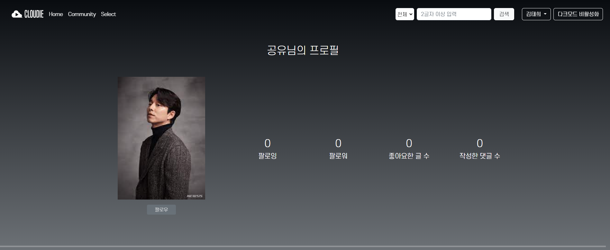

    * 프로필 사진 변경 버튼이 팔로우, 언팔로우 버튼으로 변경된다.
    * 이외의 개인정보는 user 자신 프로필과 구성이 동일하다.
    * 영화 친구 신청, 매칭 성공 목록, 영화 파트너 찾기 기능은 표시되지 된다.

* 로그인

  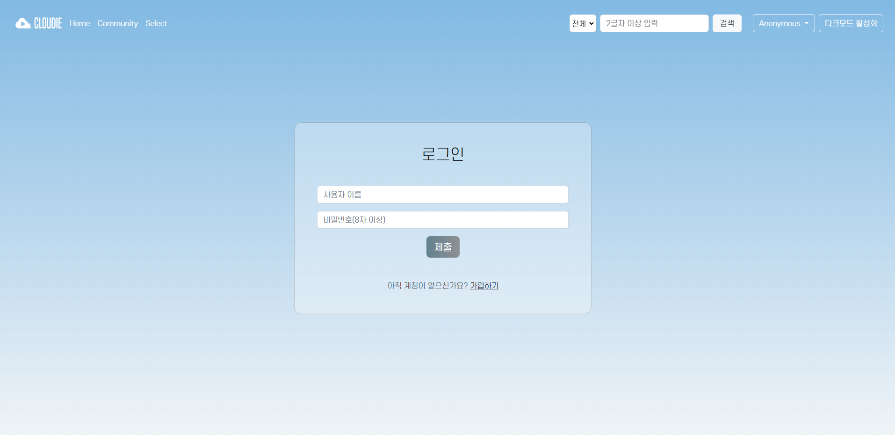

  * 등록된 user의 username과 password 입력 후 올바른 계정일 경우 제출 클릭시 로그인이 진행된다.
  * 계정이 없는 경우 하단의 가입하기를 통해 accounts:signup으로 이동해 회원가입을 진행할 수 있다.
  * 로그인에 성공한 경우 movies:index로 이동돼 서비스를 사용할 수 있다.

- change_password

   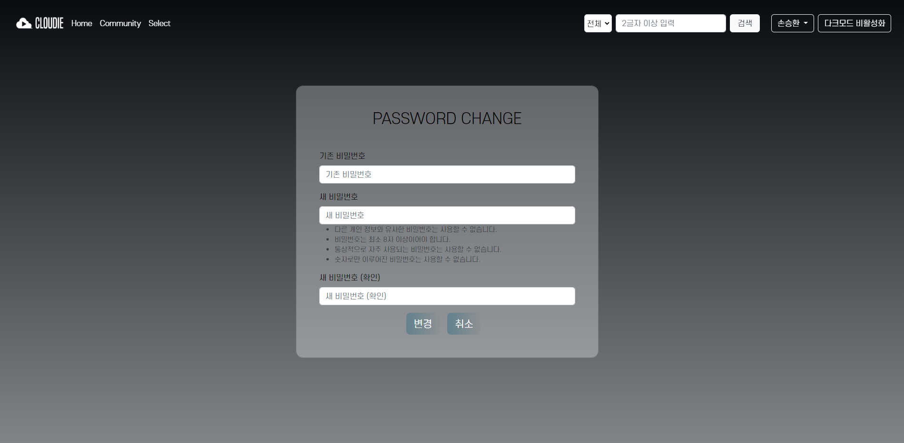

   -  회원 정보 변경 시 비밀번호 변경 폼으로 이동하는 링크를 통해서만 접속할 수 있다.
   -  기존 비밀번호, 새 비밀번호, 새 비밀번호 확인 으로 구성되어있다.
      -  기존 비밀번호에는 signup에서 작성한 비밀번호를 작성한다.
      -  새 비밀번호에는 변경하고자 하는 비밀번호를 작성한다.
         -  항목 하단에 지켜야할 비밀번호 규칙이 명시되어있고, 어길 시 변경이 불가능하다.
      -  새 비밀번호 확인에는 변경하고자 하는 새 비밀번호와 동일한 번호를 작성한다.
   -  하단의 변경 버튼을 클릭하면 비밀번호 변경이 완료되고, 취소 버튼을 클릭하면 변경이 취소된다.

- signup

   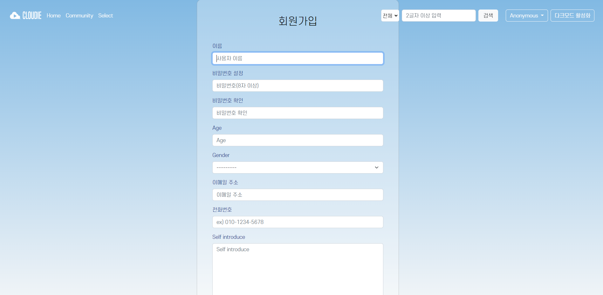

   - 유저가 회원가입을 할 수 있는 페이지이다.
   - 사용자 이름, 비밀번호, 비밀번호확인, 나이, 성별, 이메일주소, 전화번호, 자기소개항목, 등록버튼으로 이루어져있다.
     - 사용자 이름에는 로그인 시 입력할 id (username)을 입력한다.
     - 비밀번호 에는 사용할 비밀번호를 입력한다.
     - 비밀번호 확인에는 위 비밀번호와 동일한 번호를 입력한다.
       - 다르게 작성한다면 회원가입 진행이 불가능하다.
     - 나이에는 정수로 본인의 나이를 입력한다.
     - 성별은 textchoice로, 남성과 여성 중 선택할 수 있다.
     - 이메일 주소에는 이메일 주소를 입력한다.
       - 이메일의 형식을 갖추지 않으면 회원가입 진행이 불가능하다.
     - 전화번호에는 전화번호를 입력한다.
       - 올바른 전화번호의 형식을 갖추지 않으면 회원가입 진행이 불가능하다.
     - 자기소개에는 본인을 소개하는 글을 작성하면 된다.
     - 상기 모든 사항을 제대로 입력한 뒤 등록 버튼을 클릭하면 회원가입이 완료되고 로그인 페이지로 이동된다.
   - 최하단에 위치한 로그인하러 가기 를 클릭하면 login 페이지로 이동할 수 있다.

* 회원 정보 수정

  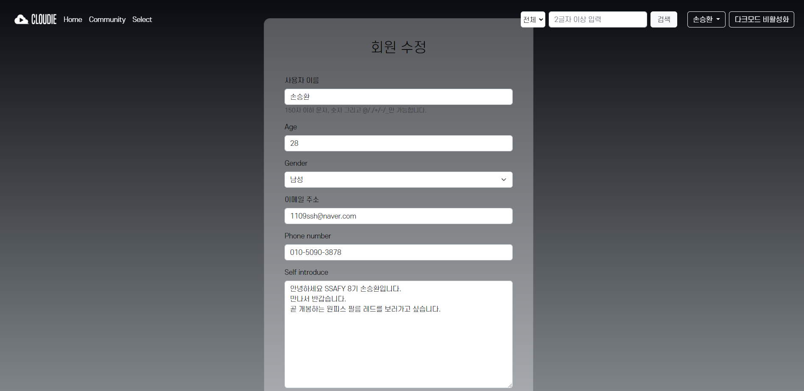

  * 유저가 가입시 작성한 내용을 기반으로 수정을 진행할 수 있다.
  * 해당 페이지는 프로필에서 사진 변경을 클릭시 해당 페이지로 이동하게 되고 파일을 선택해 프로필 이미지를 변경할 수 있다.
  * 이때도 회원가입과 마찬가지로 유효하지 않은 양식은 가입되지 않는다.

유저 정보

- User 모델은 AbstractUser를 상속받아 사용했다.
  - 기본 User에 유저끼리 팔로잉을 할 수 있도록 followings라는 ManyToManyField를 추가해 주었다.
  - following은 유저가 유저 자신을 참조하는 방식이므로 'self'인자를 포함했고  symmetrical=False로 설정하였다.
  - lovings는 매칭에 사용되는 필드로 ManyToManyField로 상대 유저와 자신과의 매칭 정보를 포함한다.
  - 이외에도 age, gender, phone_number 필드를 추가하여 매칭 성공 시 해당 필드를 공개할 수 있도록 활용하였다.

#### 영화

- 영화 정보
  - TMDB API를 사용하여 python 코딩을 통해 약 10000개의 영화 정보를 받아 json파일로 저장했다. 이 때 저장된 영화 정보의 장르 데이터가 pk로 되어있었기 때문에 추가로 같은 방법을 사용하여 영화장르 데이터도 json파일에 추가하여 저장했다.
  - TMDB API에서 제공하는 popular, now playing등의 실시간 영화 추천 정보를 받아오기 위해 axios를 활용하였다.
  
- 영화 모델은 아래와 같이 구성했다.
  - Genre 
    - json화한 장르데이터를 담기 위한 모델로, 구성은 아래와 같다.
      - genre_id : 영화데이터의 genre의 pk를 담기 위한 필드이다.
      - name : 각 pk의 이름을 담기 위한 필드이다.
  - Movie
    - json화한 영화데이터를 담기 위한 모델로, 구성은 아래와 같다.
      - genres : 영화 장르 필드이고, Genre 모델과 M:N 관계를 가진다.
      - like_users : 해당 영화를 like 한 user목록으로, User 모델과 M:N 관계를 가진다.
      - poster_path : 영화 포스터의 url을 담기 위한 필드이다.
      - overview : 영화의 요약 줄거리를 담기 위한 필드이다.
      - release_date : 영화 개봉일을 담기 위한 필드이다.
      - movie_id : 영화데이터에서 영화의 id값을 담기 위한 필드이다.
      - title : 영화 제목을 담기 위한 필드이다.
      - popularity : 영화 관객 수를 담기 위한 필드이다.
      - runtime : 영화의 총 상영시간을 담기 위한 필드이다.
      - vote_average : 영화의 평점을 담기 위한 필드이다.  
  
- select
  
  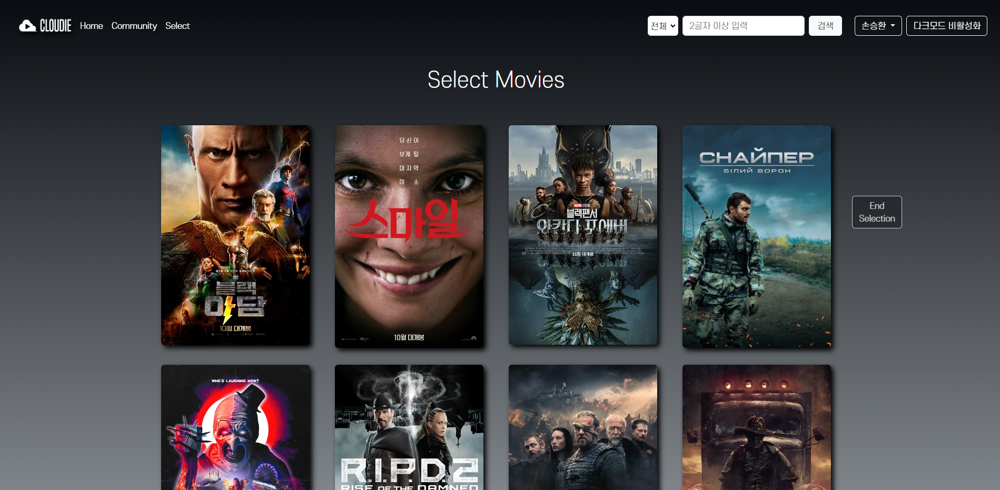
  
  - 해당 페이지는 유저가 회원 가입 후 바로 연결되고, 이후엔 로그인 상태로 navbar의 select버튼을 통해 이동할 수 있다.
  - database에 담긴 영화 중 popularity가 높은 40개의 영화 중 유저가 맘에드는 영화들을 선택할 수 있다.
  - 영화선택과 취소를 자유롭게 할 수 있고, 선택된 영화는 흐리게 표시되어 시각적으로 구분할 수 있다.
  - 선택된 영화들의 정보는 개인 프로필 페이지에서 확인할 수 있으며 추천 영화를 선별하기 위한 장르 데이터 분석에도 반영된다.
  - 영화 선택을 중단하고 싶으면 스크롤을 따라다니는 end select 버튼을 클릭해 언제든 중단할 수 있다.


- index
  
  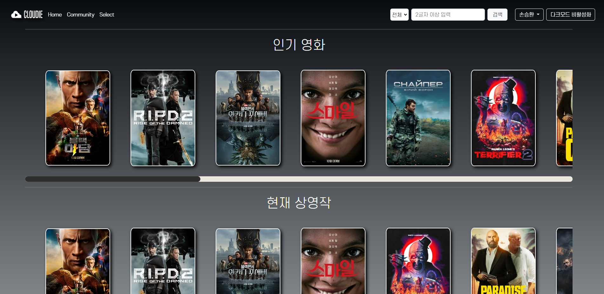
  
  - movie app의 메인 페이지에서는 인기 영화, 현재 상영작, 상영 예정작, 높은 평점, user가 좋아요 한 영화, user가 좋아하는 장르의 영화, 랜덤 영화를 display한다. 각 구현 내용은 아래와 같다.
    - 인기 영화
      - api와 axios를 이용한 비동기 통신으로 tmdb로부터 실시간으로 trending 영화들의 목록을 받아온다.
    - 현재 상영작
      - api와 axios를 이용한 비동기 통신으로 tmdb로부터 실시간으로 now_playing 영화들의 목록을 받아온다.
    - 상영 예정작
      - api와 axios를 이용한 비동기 통신으로 tmdb로부터 실시간으로 upcoming 영화들의 목록을 받아온다.
    - 높은 평점
      - api와 axios를 이용한 비동기 통신으로 tmdb로부터 실시간으로 top rated 영화들의 목록을 받아온다.
    - user가 좋아요 한 영화
      - 회원가입 후 select에서 user가 직접 like 한 영화들의 목록이 display된다. 해당 페이지는 상단 navbar의 Select 항목을 통해 언제든지 다시 이동이 가능하고 또한 좋아요 취소 및 다른 영화에 대한 좋아요를 통해 목록을 상시 변경할 수 있다.
    - user가 좋아하는 장르의 영화
      - select 페이지에서 본인이 좋아요 누른 영화의 json 데이터에는 해당 영화의 장르가 pk값으로 저장되어있다.  각 pk값과 pk_cnt를 딕셔너리로 만든 뒤 user가 like한 모든 영화들의 데이터를 순회하면서 각 pk가 얼마나 많이 중복되었는지를 체크한 뒤 value(pk_cnt)가 가장 높은 key(pk)를 pk로 갖는 장르를 포함한 영화 중 12개를 뽑아 display한다.
    - 랜덤 영화
      - 원래는 db의 모든 영화를 보여주도록 구현했었으나, 데이터 양이 너무 많아 그 중 랜덤으로 몇 개의 영화를 추출하여 display 하는 로직으로 변경하였다.
      - json화하여 load해둔 모든 영화데이터 중 랜덤으로 12개의 영화를 뽑아 display한다.
  
- detail
  
  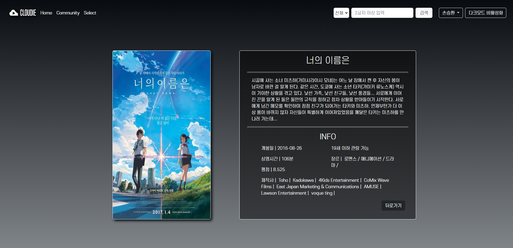
  
  - detail 페이지는 database가 아니라 실시간으로 가져온 영화에 대한 정보를 표시해야 할 수도 있기 때문에 유저가 특정 영화를 클릭 시 detail 페이지에서 다시 axios를 활용해 영화 정보를 불러왔다.
  - tmdb api에서 특정 영화의 detail정보를 가져오기 위해서는 해당 영화의 id가 필요하기 때문에 detail 페이지로 전달된 영화의 id 정보를 javascript로 넘겨주어 활용하였다.
  - 특정 영화에 대해 포스터 url이 존재하지 않는 경우 '포스터 준비중'이라는 자체 이미지를 표시하였다.


#### 커뮤니티

- model
   - Review 모델은 다음의 field를 가진다.
      - title : 게시글의 제목을 담기 위한 필드이다.
      - movie_title : 게시글을 작성하려는 관련 영화 제목을 담기 위한 필드이다.
      - rank : user가 주는 영화의 평점을 저장할 필드이다.
      - content : 게시글의 내용을 담기 위한 필드이다.
      - created_at : 게시글 생성 시점을 담기 위한 필드이다.
      - updated_at : 게시글 수정 시점을 담기 위한 필드이다.
      - user : 해당 게시글을 작성한 User이고, User모델과 N : 1관계를 가진다.
      - like_users : 해당 게시글에 좋아요를 누른 User목록이고, User모델과 M : N관계를 가진다.

   
   
   - Comment 모델은 다음의 field를 가진다.
      - review : 댓글을 단 Review이고, Review모델과 N : 1 관계를 가진다.
      - user : 댓글을 작성한 User이고,  User모델과 N : 1 관계를 가진다.
      - content : 댓글의 내용을 담기 위한 필드이다.
      - like_users : 댓글에 좋아요를 누른 User들의 목록이고, User모델과 M : N 관계를 가진다.
   
      
   
- index
  
   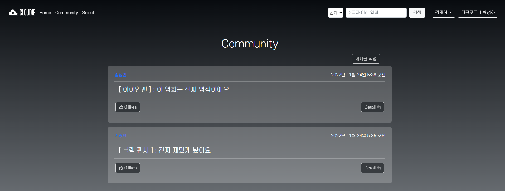
   
   - index페이지에서는 현재 작성되어 있는 게시글들을 확인할 수 있다.
   - 게시글들은 아래로 쌓이면서 가장 나중에 작성된 게시물이 최상단에 나타나도록 배치했다.
   - 각 게시글 마다 좌측 하단에 클릭이 가능한 좋아요 버튼이 있고, 다시 클릭하면 취소된다.
   - index에서는 게시글의 작성자, 작성시간, 관련 영화 및 게시글 제목을 확인할 수 있다.
     - 작성자의 이름을 클릭하면 작성자의 profile 페이지로 이동할 수 있다.
   - 각 게시글마다 우측 하단에 클릭이 가능한 Detail 버튼이 있고, 클릭 시 해당 게시글의 세부 페이지로 이동할 수 있다. 


- create

   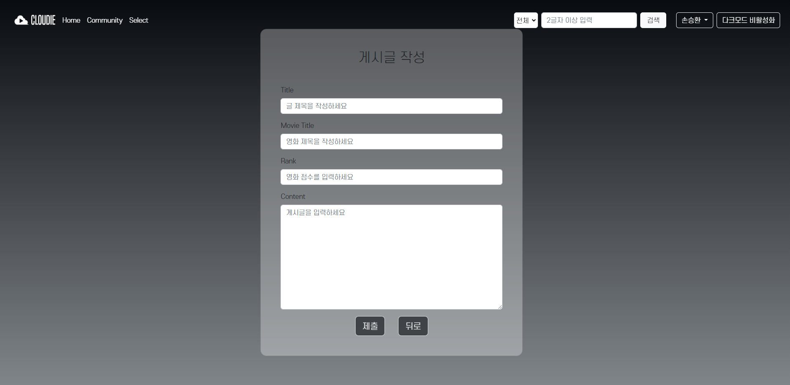

   - 게시글을 새로 생성할 수 있는 페이지
   - 항목은 상기의 Review 모델의 항목과 동일하다(created_at, updated_at, user, like_users 제외)
   - 작성한 게시글 수는 개인 프로필에서 확인할 수 있다.


- detail

   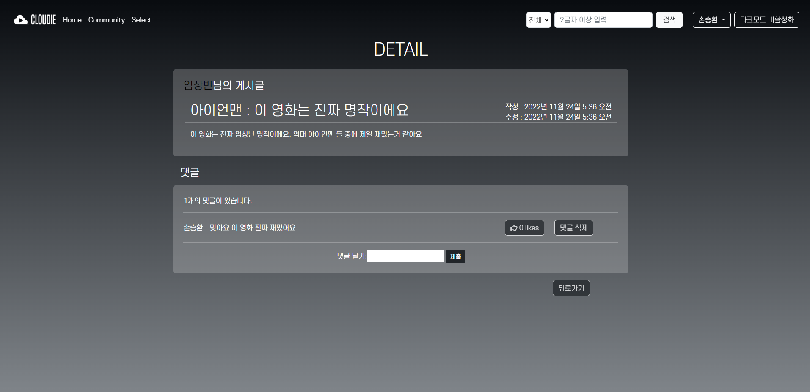

   - index 페이지에서 한 게시글의 detail 버튼을 클릭 시 이동할 수 있다.
   - detail은 게시글 영역과 댓글 영역이 존재한다.
   - 게시글영역에는 작성자 이름, 관련 영화 제목, 게시글 제목, 작성 시간, 최종 수정 시간, 게시글 내용이 있다.
     - 작성자 이름을 클릭하면 작성자의 profile 페이지로 이동할 수 있다.
     - 게시글 작성자가 본인의 게시글의 detail 페이지로 들어가면 게시글 수정 버튼, 게시글 삭제 버튼이 나타난다.
       - 게시글 수정 버튼을 클릭하면 게시글의 각 항목을 수정할 수 있는 페이지로 이동할 수 있다.
       - 게시글 삭제 버튼을 클릭하면 게시글을 삭제할 수 있다.
   - 댓글 영역은 count()를 사용해 몇 개의 댓글이 달렸는지를 확인할 수 있는 문구와 그 아래로 모든 댓글이 나타나도록 구성했다.
     - 각 댓글에는 클릭이 가능한 좋아요 버튼이 있고, 다시 클릭하면 취소된다.
     - 본인이 작성한 댓글의 경우엔 댓글 삭제 버튼이 있고, 클릭하면 댓글을 삭제할 수 있다.


- update

   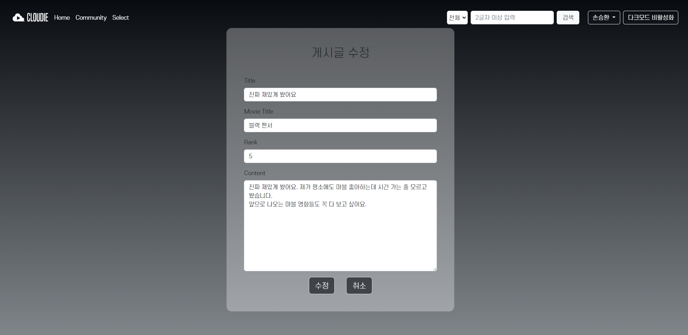

   - 본인 게시글의 detail페이지에서 게시글 수정 버튼을 클릭하여 이동할 수 있는 페이지이다.
   - 게시글을 작성할때와 같은 항목들을 display하며, 아무것도 입력하지 않은 상태일 땐 원래 내용이 적혀있다.
   - 하단의 수정 버튼을 클릭하면 수정사항이 적용되고, 취소 버튼을 클릭하면 수정 작업이 취소된다.


- delete

   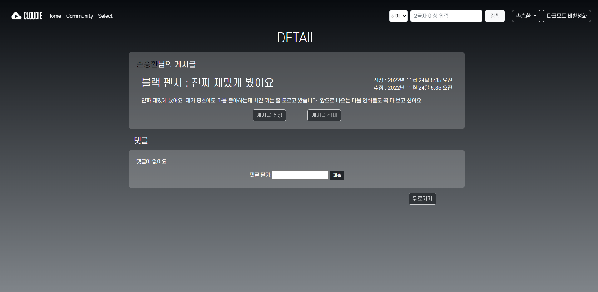

   - 본인이 작성한 게시글의 detail페이지에서 게시글 삭제 버튼을 클릭하면 삭제 작업이 실행되도록 연결되어있는 버튼이다.


###	 주요 로직

* DB 구축

  * 장르 데이터 불러오기

    장르 정보가 담긴 tmdb api  url을 저장한다.

    추출된 json 정보 중 genre 이름이 있는 경우에만 genre_id와 name을 fields로 지정해 가져온다.

    data는 pk값, model명, fields를 포함한 json 데이터로 total_data에 추가하여 genre_data.json파일에 입력한다.

  * 영화 데이터 불러오기

    tmdb api에서 500페이지를 순회하며 release_date가 있는경우에만 데이터를 불러온다.

    영화 model에 지정된 field들에 대한 정보만 fields에 담아 상기의 장르와 동일하게 data에 pk, model명, fields을 담아 최종적으로 total_data에 저장한다.

    저장된 데이터는 movie_data.json에 저장한다.

* 실시간 영화 불러오기

  tmdb api의 url을 저장하여 axios를 통해 정보를 불러온다. 불러온 영화 정보가 영화가 아닌 드라마인 경우 pk값이 영화 id와 상이하여 로드에 문제가 있는 점을 해결하기 위해 각각의 디테일 정보를 확인해 현재 불러온 영화와 제목이 일치 하지 않으면 표시하지 않도록 하였다.

  불러온 데이터들은 li태그를 만들어 img를 a태그에 포함해 추가해 준다.

  영화에 대한 정보가 남아 있기 때문에 영화 클릭시 디테일 페이지로 이동 할 수 있고 이동한 페이지에서는 해당 pk값을 토대로 자세한 정보를 불러온다.

* 장르 필터

  * genre_ids들을 value가 0인 딕셔너리로 지정해 놓는다.
  * select에서 선택한 가각의 영화들을 순회하며 장르 정보를 조회해 해당하는 genre_id의 값을 1씩 증사킨다.
  * 산출된 dictionary에서 가장 많이 카운팅 된 장르르 max_genre로 설정해 user의 favorite정보에 저장한다.
  * 저장된 데이터는 친구 매칭 및 영화 추천에 활용할 수 있다.
  * 영화들을 순회하며 max_genre와 일치하는 genre id를 가진 영화들을 recommends에 추가하여 반환한다.

* 매칭

  * 영화 친구 신청
    * 상대 user로부터 요청이 온 경우 나의 users.lovers에 상대가 저장되어 있으므로 나의 lovers 목록을 순회하며 내가 아직 상대의 lovers목록에 포함되어 있지 않으면 상대 user의 요청에 대한 알림을 띄운다.
    * 이때 나의 lovers목록에 아무도 없으면 아직 친구 신청 목록이 없음을 알린다.
  * 매칭 목록
    * 나의 lovers 목록들을 순회하면서 상대 user의 lovers 목록에 내가 있으면 매칭이 성공된 경우이므로 d-none의 속성을 해제해 표시한다.
    * 반면 상대 user의 lovers 목록에 내가 없으면 아직 매칭 성공이 된 경우가 아니므로 d-none 속성으로 정보를 보여주지 않는다.
  * 영화 친구 찾기
    * 나와 최애 장르가 동일한 사람의 정보를 넘겨받아 나를 제외한 user들을 영화 파트너 추천으로 표시한다.

  각각 항목들의 버튼에는 비동기 처리를 통해 수락, 거절 시 바로 매칭목록에 반영 된다.

  영화 친구 찾기에서 영화 신청의 경우에도 영화 신청을 하면 비동기로 수락 대기중 상태로 변경된다.


## 프로젝트 후기

### 임상빈

 프로젝트를 처음 시작할 땐 사실 막막하고 앞이 안보이는 기분이었다. 백지부터 시작해서 무언가 결과물을 만들어내기엔 나의 수준이 많이 부족한 것 같다는 생각 뿐이었다. 하지만 마음 맞는 좋은 팀원을 만나 매일매일 자기 전까지 함께 의견을 나누며 나아가다 보니 여기까지 달려올 수 있었다. 아마 혼자 했다면 지금보다 훨씬 수준낮은 결과물이 나왔을지도 모른다. 이번 프로젝트로 페어프로그래밍의 힘을 몸소 느낄 수 있었고 또한 git을 활용한 협업에도 숙련도를 얻었다. 여러 느낀 점들이 있지만 그중에서도 가장 크게 와닿는 것은, 프로젝트 이전에는 5개월동안 배우고 실습했던 내용들을 '나 이거 할 줄 안다' 라고 말하기 민망했다면 프로젝트 이후인 지금은 자신있게 '할 수 있어' 라고 말할 수 있게 되었다는 점이다.

### 손승환

 평소 다른 친구들 보다 학습량이 많이 부족했다고 생각한 나는 프로젝트를 처음 시작할 때 걱정이 앞섰다.  한 학기 동안 배운 막대한 내용을 모두 적용시켜야 했고 이외에도 부족한 점은 스스로 찾아 구현해야 한다는 생각에 두려움이 컸던 것 같았다. 하지만 한 학기 동안 호흡을 맞춰온 파트너와 서로의 생각을 활발하게 공유하며 프로젝트를 진행하니 걱정보다는 빠르게 작업이 진행되었다.

짧은 기간이라 추가적으로 구현해 보고 싶었던 기능들을 다 시도해 보지 못해 아쉬었지만 이번 프로젝트를 계기로 방학, 혹은 2학기 때 더 활발한 프로젝트를 진행해 볼 수 있다는 자신감이 생겼다.

한 학기 중 가장 뿌듯한 1주일이었다.

### 임상빈 / 손승환

프로젝트 초반, 아이디어가 확정 된 후 큰 흐름을 그리고 세부적인 사항들은 매 진행 과정마다 회의를 하며 수정해 나가니 처음엔 엄두도 나지 않던 계획들이 하나 하나 완성되기 시작했다. 기존에 배웠던 내용들이 프로젝트를 하며 다시 복습을 할 수 있는 기회가 되었고 실제로 적용을 하며 공부를 하니 더 확실하게 이해할 수 있었다.

프로젝트 중반, 점점 앱이 많아 지고 많은 페이지들이 연동되면서 git에도 오류가 발생하기 시작 했고 작성한 코드에서도 오랜 시간을 소요해야 하는 문제점들이 발생했다. 하지만 많은 시간을 투자해 결국 문제를 해결했을 땐 내 스스로가 성장함을 느낄 수 있었다.

프로젝트 후반, 높은 완성도를 위해 새로운 기능을 구현하는 것 하나 하나가 조심스러웠다. 후반부 까지 프로젝트를 진행하며 파트너와 누구보다 많은 시간을 투자해 프로젝트에 임하니 새로운 기능을 추가하고 싶은 욕심이 생겨나기 시작했다. 하지만 마감 기한까지 완성할 수 있는지 판단 후 작업에 뛰어들어야 했기 때문에 신중한 선택이 필요했다.

프로젝트를 마무리 하고 나니 1주일이라는 짧은 기간이지만 SSAFY에 입과할 때 내가 개발자가 되고 싶었던 이유를 다시금 느낄 수 있었다. 상상만 하던 기능들을 하나하나 실제로 구현하였고 큰 보람을 느꼈다.
